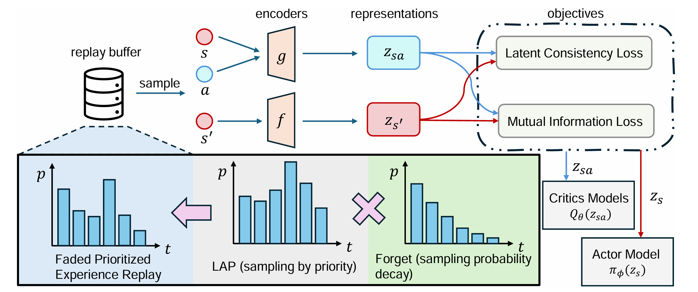
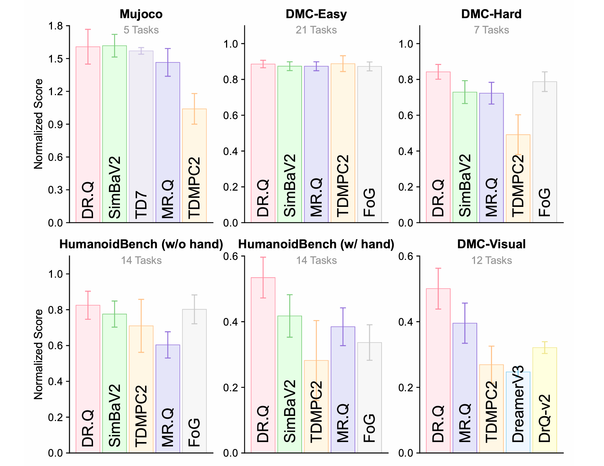
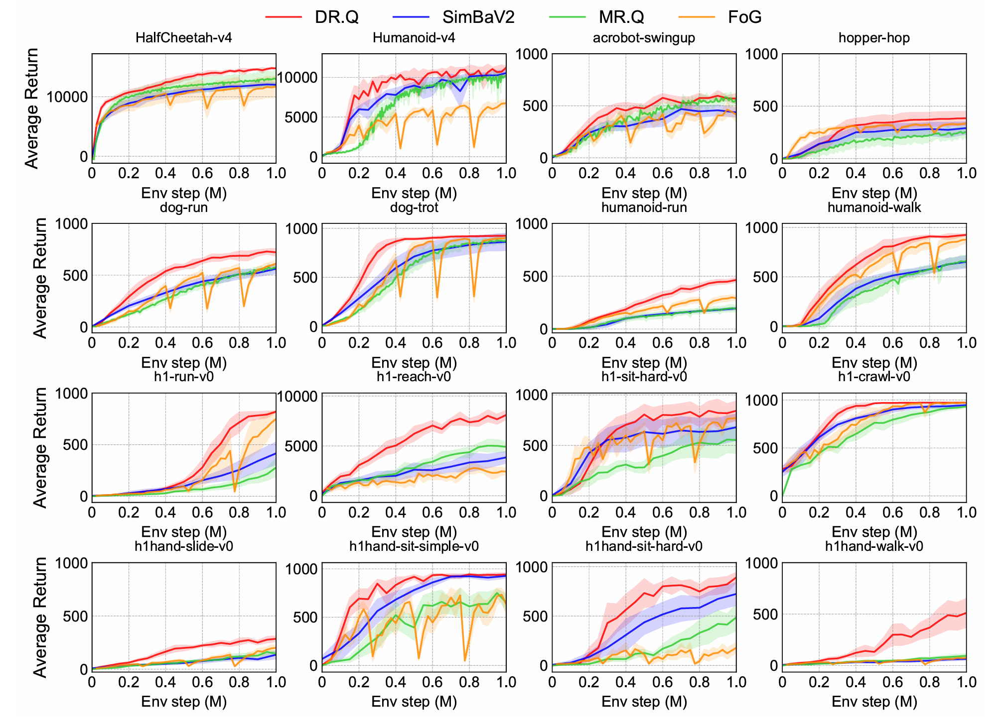

# DR.Q: Debiased Model-based Representations for Sample-efficient Continuous Control

[](https://openreview.net/forum?id=ZP1p8k106p)
[](https://huggingface.co/)

Official pytorch implementation of **DR.Q** by Jiafei Lyu, Zichuan Lin, Scott Fujimoto, Kai Yang, Yangkun Chen, Saiyong Yang, Zongqing Lu, and Deheng Ye. The code is built upon the [MR.Q codebase](https://github.com/facebookresearch/MRQ).


## Overview

The framework of DR.Q is shown below:



## Benchmark Performance






## Repository Structure

```

├── DRQ/
|   ├── main.py                 # Experiment entry point and training loop
│   ├── DRQ.py                  # Agent, encoder training, RL training, TwoHot reward
│   ├── models.py               # Neural network architectures (Encoder, Policy, Value)
│   ├── buffer.py               # Faded Prioritized Experience Replay buffer
│   ├── env_preprocessing.py    # Unified wrappers for all benchmark suites
│   └── utils.py                # Logging and dataclass utilities
├── results/
│   ├── drq.csv                 # DR.Q results
│   ├── mrq.csv                 # MR.Q baseline results
│   ├── fog.csv                 # FOG baseline results
│   └── simbaV2_utd2.csv        # SimbaV2 baseline results
├── assets/
│   ├── framework.png
│   ├── benchmark_performance.png
│   └── sample_efficiency.png
└── requirements.txt
```

## Installation

Python 3.11 was used for all reported experiments; Python 3.9–3.12 is also supported.

```bash
pip install -r requirements.txt
```

**HumanoidBench (optional):** To run DR.Q on HumanoidBench tasks, install HumanoidBench separately by following the instructions in the [HumanoidBench repository](https://github.com/carlosferrazza/humanoid-bench).

## Usage

The benchmark suite is selected via a prefix in the environment name, followed by the original task identifier.

### Basic Usage

```bash
# MuJoCo (Gym)
python main.py --env Gym-HalfCheetah-v4
python main.py --env Gym-Humanoid-v4

# DeepMind Control Suite — proprioceptive observations
python main.py --env Dmc-cheetah-run
python main.py --env Dmc-quadruped-walk

# DeepMind Control Suite — pixel observations
python main.py --env Dmc-visual-dog-run
python main.py --env Dmc-visual-walker-walk

# HumanoidBench (requires separate installation)
python main.py --env HBench-h1-run-v0
```

## Citation

If you use this code, please cite our paper:
```
@inproceedings{lyu2026debiased,
title={Debiased Model-based Representations for Sample-efficient Continuous Control},
author={Jiafei Lyu, Zichuan Lin, Scott Fujimoto, Kai Yang, Yangkun Chen, Saiyong Yang, Zongqing Lu, Deheng Ye},
booktitle={Forty-third International Conference on Machine Learning},
year={2026},
url={https://openreview.net/forum?id=ZP1p8k106p}
}
```

## License

DR.Q is licensed under the MIT license.
